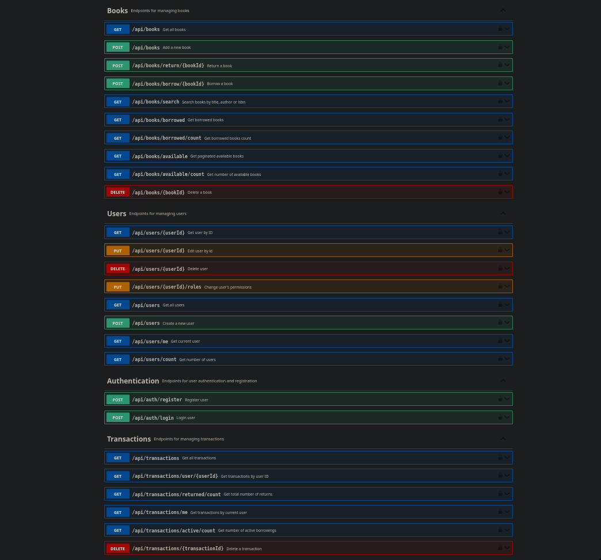

# Bookstore API

A Spring Boot application providing a RESTful API for managing a library system. This API supports book management, user accounts, JWT-based authentication, and transaction handling for borrowing and returning books.

---

## Features

### Books
- Borrow and return books.
- Manage book inventory.

### Users
- Create and manage user accounts.
- View borrowing history and account details.

### Authentication
- Secure JWT-based authentication.
- Role-based access control for users and admins.

### Transactions
- Track borrowing and returning activities.
- Log transaction details.

---

## Getting Started

### Prerequisites
- [Docker](https://www.docker.com/get-started) (optional, for containerized setup).
- Java 17 or higher.
- Gradle (if not using Docker).

---

## Running the Application

### Using Docker

1. Clone the repository:
   ```bash
   git clone git@github.com:Tuesaday-15-00-17-00-semestr-work/semester-work-assignment-tuesday-15-00-17-50-konotop-solo.git
   cd bookstore-api
   ```

2. Start the application:
   ```bash
   docker-compose up --build
   ```

3. Open Swagger UI to explore the API:
   [http://localhost:8080/swagger-ui.html](http://localhost:8080/swagger-ui.html)

   

### Running Locally (Without Docker)

1. Clone the repository:
   ```bash
   git clone git@github.com:Tuesaday-15-00-17-00-semestr-work/semester-work-assignment-tuesday-15-00-17-50-konotop-solo.git
   cd bookstore-api
   ```

2. Start the application:
   ```bash
   ./gradlew bootRun
   ```

3. Access the Swagger UI:
   [http://localhost:8080/swagger-ui.html](http://localhost:8080/swagger-ui.html)

---

## Testing the Application

Run unit and integration tests:
```bash
./gradlew test
```

---

## API Documentation

The API is documented using Swagger. Once the application is running, access the documentation at:

[http://localhost:8080/swagger-ui.html](http://localhost:8080/swagger-ui.html)

## Database

The application uses SQLite as the database. The database file is stored in the `./data` directory.

### Schema
The database schema is auto-generated and includes tables for:
- Users
- Books
- Transactions
- Roles

---

## Configuration

The application can be configured via `src/main/resources/application.properties`.

### Default Admin User
An admin user is initialized during startup with configurable credentials:

```properties
app.admin.username=admin
app.admin.password=securepassword
app.admin.email=admin228@gmail.com
```
