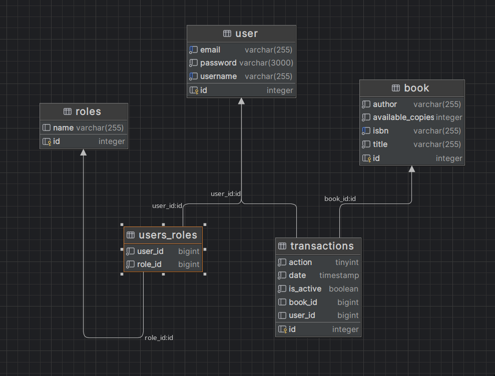

# Bookstore API

A Spring Boot application providing a RESTful API for managing a library system. The API supports book management, user accounts, JWT-based authentication, role-based access control, and transaction handling for borrowing and returning books.

---

## Features

### Book Management

- **Borrow and Return Books**: Users can borrow and return books.
- **Inventory Management**: Admins can manage book details and inventory.

### User Management

- **User Accounts**: Create and manage user profiles.
- **Borrowing History**: Users can view their borrowing history and account details.
- **Roles & Permissions**: Role-based access control with support for multiple user roles (e.g., admin, user).

### Authentication

- **JWT-Based Authentication**: Secure authentication using JSON Web Tokens (JWT) to protect endpoints.
- **Role-Based Authorization**: Admin and user roles with different levels of access to resources.

### Transaction Management

- **Track Borrowing & Returning**: Detailed logging of when users borrow and return books.
- **Transaction History**: View transaction logs, including dates, actions, and book details.

---

## Getting Started

### Prerequisites

- [Docker](https://www.docker.com/get-started) (for containerized setup, optional).
- Java 17 or higher.
- Gradle (if not using Docker).

---

## Running the Application

### Option 1: Using Docker

1. Clone the repository:

   ```bash
   git clone git@github.com:Tuesaday-15-00-17-00-semestr-work/semester-work-assignment-tuesday-15-00-17-50-konotop-solo.git
   cd bookstore-api
   ```

2. Build and run the application with Docker:

   ```bash
   docker-compose up --build
   ```

3. Once the app is running, access the Swagger UI to explore the API:
   [http://localhost:8080/swagger-ui.html](http://localhost:8080/swagger-ui.html)

### Option 2: Running Locally Without Docker

1. Clone the repository:

   ```bash
   git clone git@github.com:Tuesaday-15-00-17-00-semestr-work/semester-work-assignment-tuesday-15-00-17-50-konotop-solo.git
   cd semester-work-assignment-tuesday-15-00-17-50-konotop-solo
   ```

2. Start the application using Gradle:

   ```bash
   ./gradlew bootRun
   ```

3. Once the app is running, access the Swagger UI:
   [http://localhost:8080/swagger-ui.html](http://localhost:8080/swagger-ui.html)

---

## Testing the Application

To run unit and integration tests:

```bash
./gradlew test
```

Tests include validation of book management, authentication, role-based access control, and transaction workflows.

---

## API Documentation

The API is documented using Swagger. Once the application is running, you can explore the full API and make test requests via the Swagger UI:

[http://localhost:8080/swagger-ui.html](http://localhost:8080/swagger-ui.html)

---

## Database

The application uses **SQLite** as the database engine. By default, the database file is located in the `./data` directory, but this can be configured.

### Database Schema

The database schema includes the following tables:

- **Users**: Stores user information such as email, password, and username.
- **Roles**: Defines various roles (e.g., admin, user) for access control.
- **Users_Roles**: A join table that implements the many-to-many relationship between users and roles.
- **Books**: Stores book details such as author, title, ISBN, and available copies.
- **Transactions**: Logs borrowing and returning activities, including the user, book, and timestamp.



### Entity Relationships

- **Users and Roles**: Users can have multiple roles (many-to-many relationship via the `users_roles` table).
- **Users and Transactions**: Users can perform multiple transactions (one-to-many relationship).
- **Books and Transactions**: Each transaction is linked to a book (many-to-one relationship).

---

## Configuration

The application’s configuration is managed through `src/main/resources/application.properties`. You can modify settings such as database paths, JWT secret keys, and other properties.

### Default Admin User

During startup, a default admin user is created with credentials that can be customized in the `application.properties` file:

```properties
app.admin.username=admin
app.admin.password=securepassword
app.admin.email=admin@example.com
```

This admin account has full access to all features of the API.
