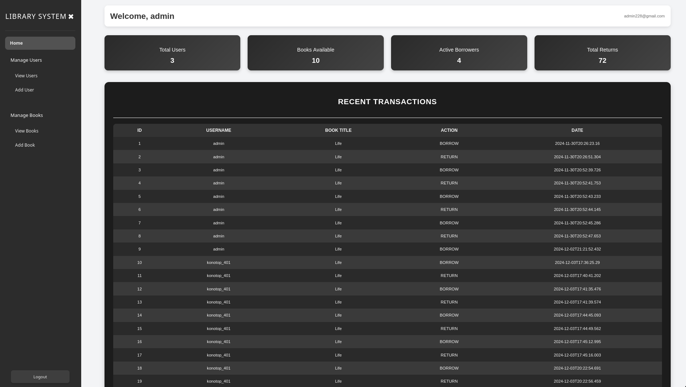
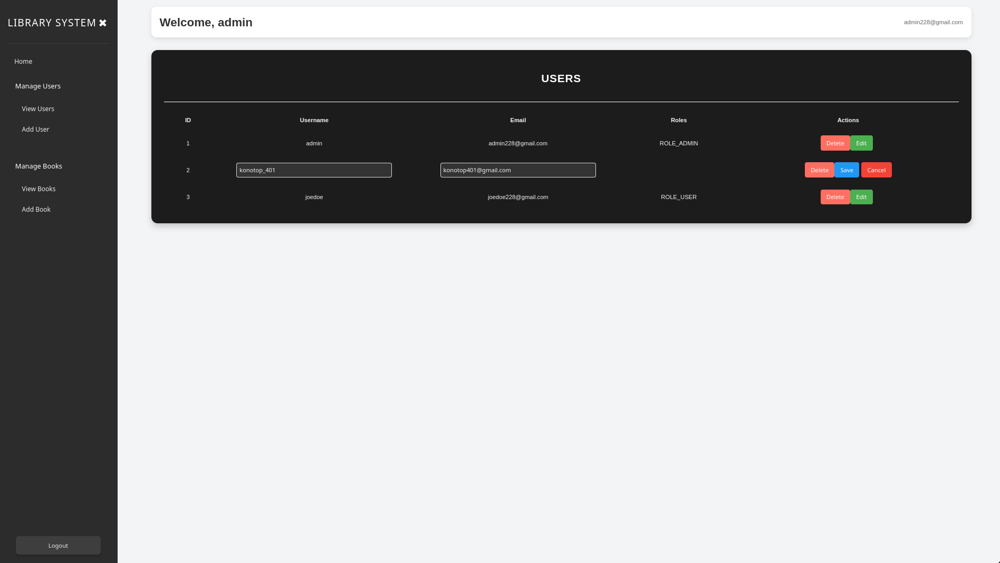

# Bookstore UI

Bookstore UI is a modern, responsive Vue.js application for managing a bookstore's operations. It includes features for managing users, books, transactions, and viewing dashboards with essential data metrics.

## Features

- **Admin Dashboard**: Overview of active borrowers, total returns, and available books.
- **User Management**: Add and manage bookstore users.
- **Book Management**: Add, view, and borrow books.
- **Transaction Logs**: View recent transactions.
- **Authentication**: Login and register functionality.

## Folder Structure

```plaintext
bookstore-ui/
├── src/
│   ├── components/      # Reusable UI components
│   ├── router/          # App routing configuration
│   ├── services/        # API service calls
│   ├── store/           # Vuex store for state management
│   ├── types/           # TypeScript type definitions
│   ├── utils/           # Utility functions
│   ├── views/           # Page-level components
│   │   ├── admin/       # Admin-specific views
│   │   ├── auth/        # Authentication-related views
│   │   ├── book/        # Book management views
│   │   ├── transaction/ # Transaction-related views
│   │   ├── user/        # User management views
├── images/              # Screenshots of application pages
├── public/              # Public assets and static files
├── App.vue              # Main Vue component
├── main.ts              # App entry point
```

## Setup and Installation

### Prerequisites

Ensure you have the following installed:

- [Node.js](https://nodejs.org/) (version 14+)
- [npm](https://www.npmjs.com/) or [yarn](https://yarnpkg.com/)

### Steps

1. Clone the repository:
   ```bash
   git clone git@github.com:Tuesaday-15-00-17-00-semestr-work/semester-work-assignment-tuesday-15-00-17-50-konotop-solo.git
   cd bookstore-ui
   ```

2. Install dependencies:
   ```bash
   npm install
   # or
   yarn install
   ```

3. Start the development server:
   ```bash
   npm run dev
   # or
   yarn dev
   ```

4. Open the application in your browser at [http://localhost:5137](http://localhost:5137).

### Build for Production

To build the application for production:

```bash
npm run build
# or
yarn build
```

The output will be located in the `dist/` folder.

## Usage

### Navigation
- **Dashboard**: Displays key metrics like the number of active borrowers and returns.
- **Books**: Add or view books and manage borrowing.
- **Users**: View and manage users of the system.
- **Transactions**: View logs of recent transactions.

### Services
The application communicates with the backend via the service layer located in the `src/services/` folder. API calls include:
- `fetchNumberOfUsers`
- `fetchNumberOfActiveBorrows`
- `fetchNumberOfReturns`
- `fetchNumberOfAvailableBooks`

## Screenshots

Here are screenshots of the application located in the `images/` folder:

### Admin Dashboard


### User Management


### Book Management


### Login Page

